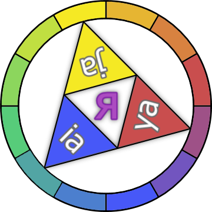

# Adalon.Transliterators

 

**_WORK IN PROGRESS_**

A collection of algorithms for transliteration/romanization of cyrillic languages.

**_WORK IN PROGRESS_**

Planned methods:
 
 - ISO-9
 - Scientific
 - ALA/LC
 - BGN/PCGN
 - ITU
 - Special-use, e.g. Passport names

Multiple cyrillic languages are expected to be supported, but the focus will be made on Russian (as this is my native language)
